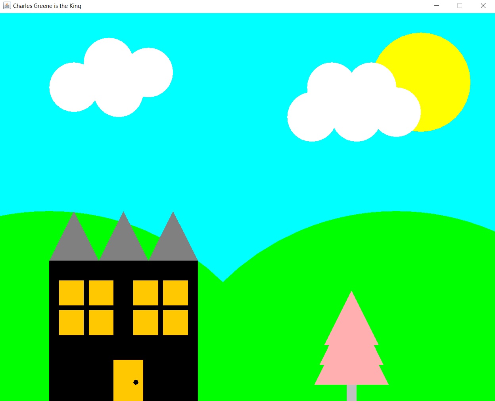

# Positioning Objects

## Image

## Description

This project is to get familiarize with (x,y) coordinates in a basic screen. The image is made from three basic object rectangle, circle and triangle. Goal is to understand constructor.

## Language

- Java
